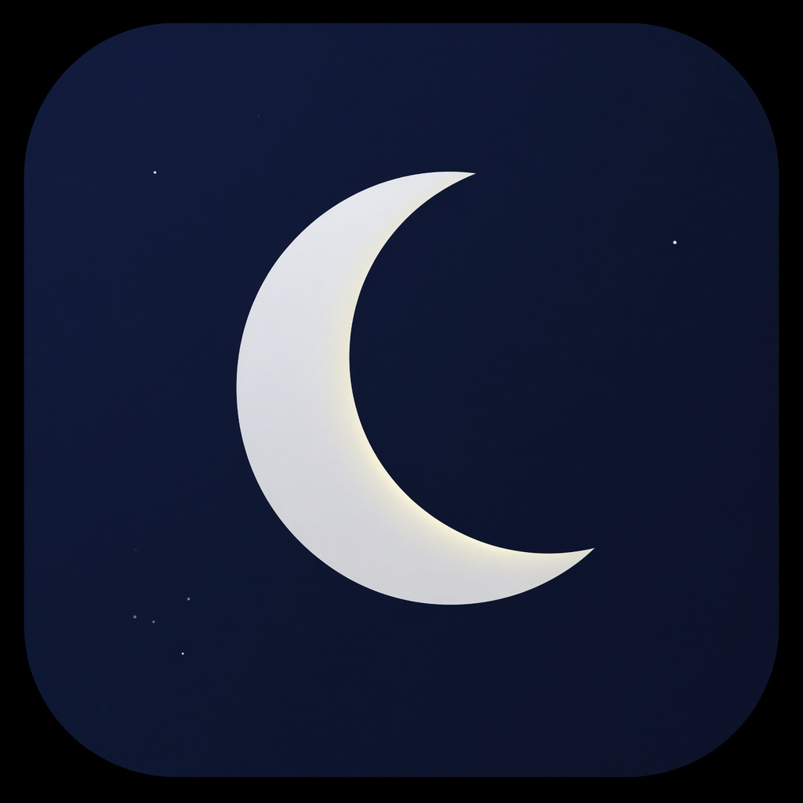

# Zoon app icon exploration — 2026

Three new directions and the previous moon identity were evaluated against silhouette, 29/40/60 pt reduction, brand continuity, dark appearance, and tint behavior. Product review rejected the abstract direction and selected a refined moon-and-stars icon that remains immediately recognizable as Zoon.

## Selected — Real Moon and Stars

This keeps the previous large crescent and midnight star field while replacing the flat vector-like moon with restrained lunar texture, natural ivory light, a cleaner full-bleed sky, and a silhouette that remains readable at notification size. The default and dark variants retain color; the tinted variant uses a high-contrast monochrome moon and stars.

Implemented assets:

- `Zoon/Assets.xcassets/AppIcon.appiconset/icon-1024.png`
- `Zoon/Assets.xcassets/AppIcon.appiconset/icon-1024-dark.png`
- `Zoon/Assets.xcassets/AppIcon.appiconset/icon-1024-tinted.png`

## Previous identity reference

The crescent scale, placement, midnight palette, and sparse star field are the continuity anchors for the selected icon.

## 1. Orbit Pulse — rejected after product review

A continuous biological orbit surrounds a compact intelligence/recovery core. It survived small sizes, but product review found it too abstract and inexpensive-looking compared with Zoon's established moon identity.

## 2. Rhythm Ribbon

The night-to-dawn ribbon conveys continuity and change. It was rejected because the silhouette approaches a familiar infinity loop and loses Zoon’s orbit continuity.

## 3. Rhythm Aperture

Three segments represent Sleep, Recovery and Daylight. It was rejected because the extra segment and color make the mark busier at notification size and can read as a camera aperture.

## Production checks

- No text or externally licensed marks.
- Default, dark and tinted entries are declared in `Contents.json`.
- The system applies the final icon mask; source art does not bake in rounded corners.
- Final release review must inspect the compiled icon on Home Screen, Settings, Spotlight, notifications, tinted Home Screen, dark appearance and App Store Connect processing.

The bitmap concepts and final realistic moon variants were produced with the built-in image generation tool, then resized to exact opaque 1024 × 1024 PNG files for the asset catalog.
