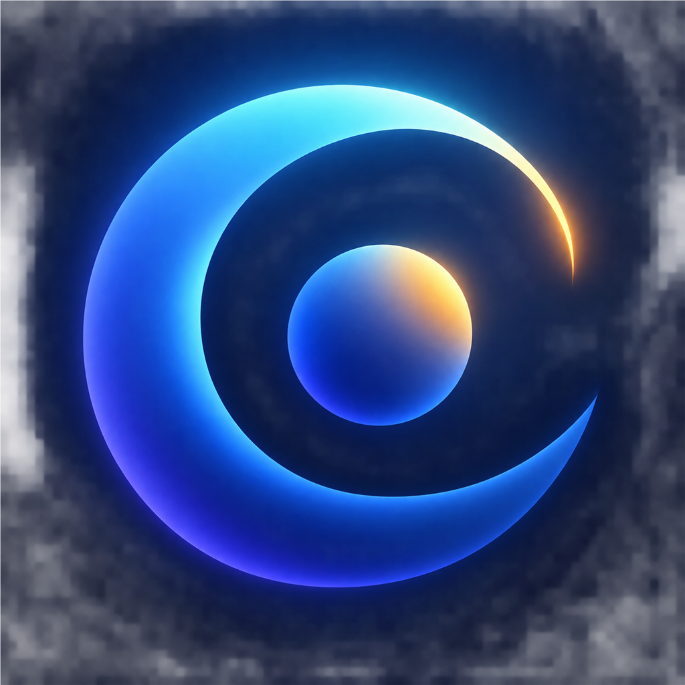

# Zoon app icon exploration — 2026

Three 1024 px directions were evaluated against silhouette, 29/40/60 pt reduction, brand continuity, dark appearance, and tint behavior.

## 1. Orbit Pulse — selected

A continuous biological orbit surrounds a compact intelligence/recovery core. Indigo and cyan retain Zoon’s sleep identity; a small dawn transition expands the brand from night tracking to a 24-hour rhythm. It has the strongest unique silhouette and survives small sizes without relying on thin detail.

Implemented assets:

- `Zoon/Assets.xcassets/AppIcon.appiconset/icon-1024.png`
- `Zoon/Assets.xcassets/AppIcon.appiconset/icon-1024-dark.png`
- `Zoon/Assets.xcassets/AppIcon.appiconset/icon-1024-tinted.png`

## 2. Rhythm Ribbon

The night-to-dawn ribbon conveys continuity and change. It was rejected because the silhouette approaches a familiar infinity loop and loses Zoon’s orbit continuity.

## 3. Rhythm Aperture

Three segments represent Sleep, Recovery and Daylight. It was rejected because the extra segment and color make the mark busier at notification size and can read as a camera aperture.

## Production checks

- No text or externally licensed marks.
- Default, dark and tinted entries are declared in `Contents.json`.
- The system applies the final icon mask; source art does not bake in rounded corners.
- Final release review must inspect the compiled icon on Home Screen, Settings, Spotlight, notifications, tinted Home Screen, dark appearance and App Store Connect processing.

The bitmap concepts were generated with the built-in image generation tool from the product brief, then resized to exact 1024 × 1024 PNG files for the asset catalog.
